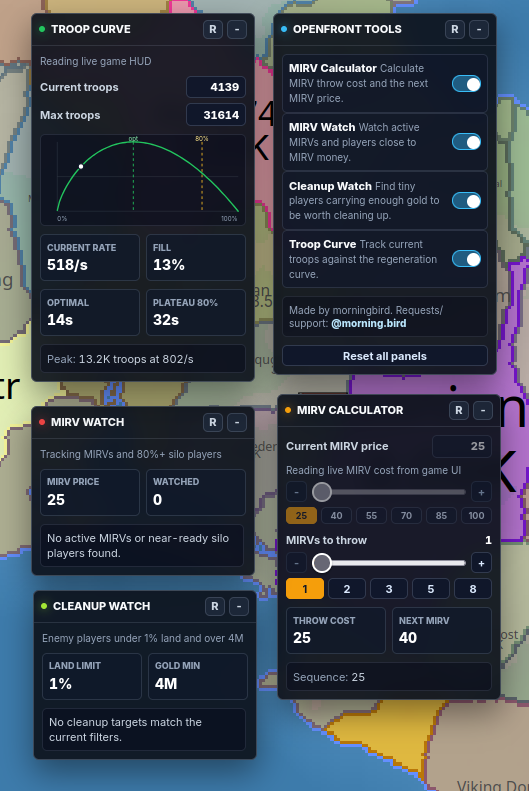

# OpenFront Tools

[](openfront-tools.user.js)
[](CHANGELOG.md)
[](LICENSE)
[](https://openfront.io/)

Floating utility panels for [OpenFront](https://openfront.io/).

[](https://raw.githubusercontent.com/michaldaniel/openfront-tools-userscript/main/openfront-tools.user.js)



## Features

- MIRV Calculator: reads the live MIRV price when available and calculates throw cost.
- MIRV Watch: tracks active MIRVs and players close to MIRV money.
- Cleanup Watch: finds enemy players with less than 1% land and more than 4M gold.
- Troop Curve: plots your current troop position against the regeneration curve.
- Settings panel: turn individual tools on or off, reset panel positions, and keep the UI compact.

## Installation

1. Install a userscript manager such as [Tampermonkey](https://www.tampermonkey.net/) or [Violentmonkey](https://violentmonkey.github.io/).
2. Click the install button above, or open the raw userscript file directly:
   `https://raw.githubusercontent.com/michaldaniel/openfront-tools-userscript/main/openfront-tools.user.js`
3. Your userscript manager should prompt you to install or update OpenFront Tools.
4. Visit `https://openfront.io/`.

## Manual Install

If raw install is not available yet:

1. Open `openfront-tools.user.js`.
2. Copy the full file contents into a new userscript in your userscript manager.
3. Save it and reload OpenFront.

## Support

Requests and support: Discord `@morning.bird`.

For bug reports, include:

- browser name and version
- userscript manager name
- OpenFront Tools version
- what panel was enabled
- console output after running `OpenFrontTools.enableDebug()`

## Debugging

Open browser DevTools on `openfront.io` and run:

```js
OpenFrontTools.enableDebug()
```

Reload the page or reproduce the issue. The script will log diagnostic messages under the `[OpenFront Tools]` prefix.

Disable debug logging with:

```js
OpenFrontTools.disableDebug()
```

## Disclaimer

OpenFront Tools is an independent userscript and is not affiliated with OpenFront.
